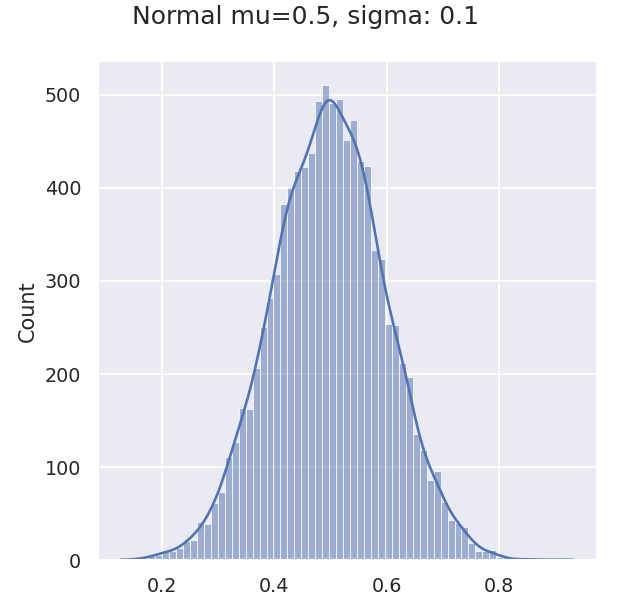
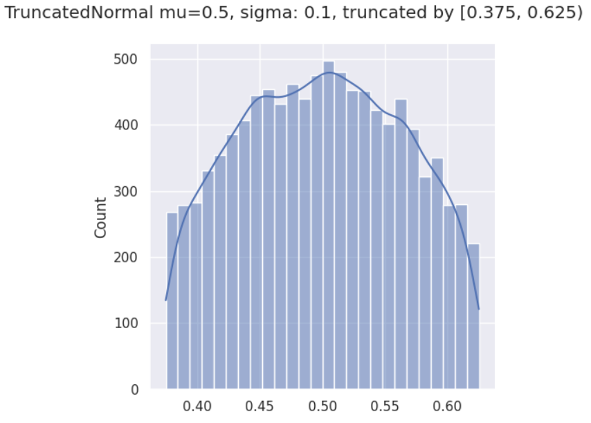

# Truncated Normal Distribution

## Features
| Normal Distribution | Truncated Normal Distribution|
| ---- | ---- |
|  |       |

## Requirements
- fmt(https://github.com/fmtlib/fmt)
- C++11

## How to use
Just add the `dist.h` and `dist.cpp` to your project.
Or here's an example for you at `main.cpp`. 
You can test it by run `bash build.sh`

## Reference
- https://people.sc.fsu.edu/~jburkardt/cpp_src/truncated_normal/truncated_normal.html

